

## Procedural outline
Turn on machines / heaters. Put mice in tailcuff room and let the room and mice acclimate to appropriate temperature for ~30-60 mins. Then, check cuffs for leaks. Put mice into restraints and perform 5 acclimation cycles + 20 recorded cycles. 

When placing mice into restraints,  
  1. Quickly place nose cuff on to avoid letting them turn around in the restraint\
  2. Make sure that you can see them breathing...  
  3. Maximize tightness of fit and breathing

## Download excel data after finishing the experiments onto thumb drive
Copy the data into a *master* excel file with two sheets, making sure that there's only one header (at the very top of the page).    

  1. You'll need to add in two columns manually to this master sheet: *Date* and *Phase*. Phase can take one of 4 values: "training", "baseline", "vehicle", "treatment". Training data ultimately gets removed, but included in the data sheet for completeness. First sheet should look like this:  
<table class="table table-striped" style="margin-left: auto; margin-right: auto;">
<caption>Metadata</caption>
 <thead>
  <tr>
   <th style="text-align:center;"> Specimen Name </th>
   <th style="text-align:center;"> Systolic </th>
   <th style="text-align:center;"> Mean </th>
   <th style="text-align:center;"> Rate </th>
   <th style="text-align:center;"> Cycle # </th>
   <th style="text-align:center;"> Date </th>
   <th style="text-align:center;"> Phase </th>
  </tr>
 </thead>
<tbody>
  <tr>
   <td style="text-align:center;"> M1 </td>
   <td style="text-align:center;"> 90 </td>
   <td style="text-align:center;"> 71 </td>
   <td style="text-align:center;"> 711 </td>
   <td style="text-align:center;"> 6 </td>
   <td style="text-align:center;background-color: green !important;"> 2021-03-09 </td>
   <td style="text-align:center;background-color: green !important;"> baseline </td>
  </tr>
  <tr>
   <td style="text-align:center;"> M1 </td>
   <td style="text-align:center;"> 110 </td>
   <td style="text-align:center;"> 80 </td>
   <td style="text-align:center;"> 603 </td>
   <td style="text-align:center;"> 7 </td>
   <td style="text-align:center;background-color: green !important;"> 2021-03-09 </td>
   <td style="text-align:center;background-color: green !important;"> baseline </td>
  </tr>
  <tr>
   <td style="text-align:center;"> M1 </td>
   <td style="text-align:center;"> 130 </td>
   <td style="text-align:center;"> 86 </td>
   <td style="text-align:center;"> 629 </td>
   <td style="text-align:center;"> 9 </td>
   <td style="text-align:center;background-color: green !important;"> 2021-03-09 </td>
   <td style="text-align:center;background-color: green !important;"> baseline </td>
  </tr>
  <tr>
   <td style="text-align:center;"> M1 </td>
   <td style="text-align:center;"> 94 </td>
   <td style="text-align:center;"> 72 </td>
   <td style="text-align:center;"> 693 </td>
   <td style="text-align:center;"> 10 </td>
   <td style="text-align:center;background-color: green !important;"> 2021-03-09 </td>
   <td style="text-align:center;background-color: green !important;"> baseline </td>
  </tr>
  <tr>
   <td style="text-align:center;"> M1 </td>
   <td style="text-align:center;"> 97 </td>
   <td style="text-align:center;"> 73 </td>
   <td style="text-align:center;"> 624 </td>
   <td style="text-align:center;"> 12 </td>
   <td style="text-align:center;background-color: green !important;"> 2021-03-09 </td>
   <td style="text-align:center;background-color: green !important;"> baseline </td>
  </tr>
  <tr>
   <td style="text-align:center;"> M1 </td>
   <td style="text-align:center;"> 94 </td>
   <td style="text-align:center;"> 72 </td>
   <td style="text-align:center;"> 637 </td>
   <td style="text-align:center;"> 13 </td>
   <td style="text-align:center;background-color: green !important;"> 2021-03-09 </td>
   <td style="text-align:center;background-color: green !important;"> baseline </td>
  </tr>
</tbody>
</table>
  2. Second sheet should be created manually based on your mice. Fill in the various fields. 
<table class="table table-striped" style="margin-left: auto; margin-right: auto;">
<caption>Metadata</caption>
 <thead>
  <tr>
   <th style="text-align:center;"> Specimen Name </th>
   <th style="text-align:center;"> Notch </th>
   <th style="text-align:center;"> Old Cage ID </th>
   <th style="text-align:center;"> New Cage ID </th>
   <th style="text-align:center;"> DOB </th>
   <th style="text-align:center;"> Body weight (g) </th>
   <th style="text-align:center;"> Date </th>
   <th style="text-align:center;"> Status </th>
   <th style="text-align:center;"> Date of death </th>
   <th style="text-align:center;"> Machine ID </th>
  </tr>
 </thead>
<tbody>
  <tr>
   <td style="text-align:center;"> M1 </td>
   <td style="text-align:center;"> RN </td>
   <td style="text-align:center;"> 643254 </td>
   <td style="text-align:center;"> 655606 </td>
   <td style="text-align:center;"> 2020-12-14 </td>
   <td style="text-align:center;"> 27.1 </td>
   <td style="text-align:center;"> 2021-03-05 </td>
   <td style="text-align:center;"> Alive </td>
   <td style="text-align:center;"> NA </td>
   <td style="text-align:center;"> 1 </td>
  </tr>
  <tr>
   <td style="text-align:center;"> M1 </td>
   <td style="text-align:center;"> RN </td>
   <td style="text-align:center;"> 643254 </td>
   <td style="text-align:center;"> 655606 </td>
   <td style="text-align:center;"> 2020-12-14 </td>
   <td style="text-align:center;"> 26.2 </td>
   <td style="text-align:center;"> 2021-03-09 </td>
   <td style="text-align:center;"> Alive </td>
   <td style="text-align:center;"> NA </td>
   <td style="text-align:center;"> 1 </td>
  </tr>
  <tr>
   <td style="text-align:center;"> M1 </td>
   <td style="text-align:center;"> RN </td>
   <td style="text-align:center;"> 643254 </td>
   <td style="text-align:center;"> 655606 </td>
   <td style="text-align:center;"> 2020-12-14 </td>
   <td style="text-align:center;"> 25.6 </td>
   <td style="text-align:center;"> 2021-03-11 </td>
   <td style="text-align:center;"> Alive </td>
   <td style="text-align:center;"> NA </td>
   <td style="text-align:center;"> 1 </td>
  </tr>
  <tr>
   <td style="text-align:center;"> M1 </td>
   <td style="text-align:center;"> RN </td>
   <td style="text-align:center;"> 643254 </td>
   <td style="text-align:center;"> 655606 </td>
   <td style="text-align:center;"> 2020-12-14 </td>
   <td style="text-align:center;"> 24.9 </td>
   <td style="text-align:center;"> 2021-03-14 </td>
   <td style="text-align:center;"> Alive </td>
   <td style="text-align:center;"> NA </td>
   <td style="text-align:center;"> 1 </td>
  </tr>
  <tr>
   <td style="text-align:center;"> M1 </td>
   <td style="text-align:center;"> RN </td>
   <td style="text-align:center;"> 643254 </td>
   <td style="text-align:center;"> 655606 </td>
   <td style="text-align:center;"> 2020-12-14 </td>
   <td style="text-align:center;"> 25.2 </td>
   <td style="text-align:center;"> 2021-03-15 </td>
   <td style="text-align:center;"> Alive </td>
   <td style="text-align:center;"> NA </td>
   <td style="text-align:center;"> 1 </td>
  </tr>
  <tr>
   <td style="text-align:center;"> M1 </td>
   <td style="text-align:center;"> RN </td>
   <td style="text-align:center;"> 643254 </td>
   <td style="text-align:center;"> 655606 </td>
   <td style="text-align:center;"> 2020-12-14 </td>
   <td style="text-align:center;"> 24.8 </td>
   <td style="text-align:center;"> 2021-03-19 </td>
   <td style="text-align:center;"> Alive </td>
   <td style="text-align:center;"> NA </td>
   <td style="text-align:center;"> 1 </td>
  </tr>
  <tr>
   <td style="text-align:center;"> M2 </td>
   <td style="text-align:center;"> XX </td>
   <td style="text-align:center;"> 643254 </td>
   <td style="text-align:center;"> 655606 </td>
   <td style="text-align:center;"> 2020-12-14 </td>
   <td style="text-align:center;"> 0.0 </td>
   <td style="text-align:center;"> 2021-03-05 </td>
   <td style="text-align:center;"> Dead </td>
   <td style="text-align:center;"> 2021-03-05 </td>
   <td style="text-align:center;"> 1 </td>
  </tr>
  <tr>
   <td style="text-align:center;"> M2 </td>
   <td style="text-align:center;"> XX </td>
   <td style="text-align:center;"> 643254 </td>
   <td style="text-align:center;"> 655606 </td>
   <td style="text-align:center;"> 2020-12-14 </td>
   <td style="text-align:center;"> 0.0 </td>
   <td style="text-align:center;"> 2021-03-09 </td>
   <td style="text-align:center;"> Dead </td>
   <td style="text-align:center;"> 2021-03-05 </td>
   <td style="text-align:center;"> 1 </td>
  </tr>
</tbody>
</table>

## Metadata Analysis
This workbook is set up to analyze two groups of mice! Just run and enjoy (you'll probably need to change out drug names...)

<table class="table table-striped" style="margin-left: auto; margin-right: auto;">
<caption>Metadata</caption>
 <thead>
  <tr>
   <th style="text-align:center;"> group </th>
   <th style="text-align:center;"> Specimen Name </th>
   <th style="text-align:center;"> Notch </th>
   <th style="text-align:center;"> Old Cage ID </th>
   <th style="text-align:center;"> New Cage ID </th>
   <th style="text-align:center;"> DOB </th>
   <th style="text-align:center;"> Status </th>
   <th style="text-align:center;"> Date of death </th>
   <th style="text-align:center;"> Machine ID </th>
   <th style="text-align:center;"> Average body weight (g) </th>
  </tr>
 </thead>
<tbody>
  <tr>
   <td style="text-align:center;font-weight: bold;color: white !important;background-color: #ed9942 !important;"> sunitinib </td>
   <td style="text-align:center;font-weight: bold;color: white !important;background-color: #ed9942 !important;"> M1 </td>
   <td style="text-align:center;font-weight: bold;color: white !important;background-color: #ed9942 !important;"> RN </td>
   <td style="text-align:center;font-weight: bold;color: white !important;background-color: #ed9942 !important;"> 643254 </td>
   <td style="text-align:center;font-weight: bold;color: white !important;background-color: #ed9942 !important;"> 655606 </td>
   <td style="text-align:center;font-weight: bold;color: white !important;background-color: #ed9942 !important;"> 2020-12-14 </td>
   <td style="text-align:center;font-weight: bold;color: white !important;background-color: #ed9942 !important;"> Alive </td>
   <td style="text-align:center;font-weight: bold;color: white !important;background-color: #ed9942 !important;"> NA </td>
   <td style="text-align:center;font-weight: bold;color: white !important;background-color: #ed9942 !important;"> 1 </td>
   <td style="text-align:center;font-weight: bold;color: white !important;background-color: #ed9942 !important;"> 25.63333 </td>
  </tr>
  <tr>
   <td style="text-align:center;font-weight: bold;color: white !important;background-color: #1e81b0 !important;"> vehicle </td>
   <td style="text-align:center;font-weight: bold;color: white !important;background-color: #1e81b0 !important;"> M3 </td>
   <td style="text-align:center;font-weight: bold;color: white !important;background-color: #1e81b0 !important;"> NN </td>
   <td style="text-align:center;font-weight: bold;color: white !important;background-color: #1e81b0 !important;"> 643254 </td>
   <td style="text-align:center;font-weight: bold;color: white !important;background-color: #1e81b0 !important;"> 655606 </td>
   <td style="text-align:center;font-weight: bold;color: white !important;background-color: #1e81b0 !important;"> 2020-12-14 </td>
   <td style="text-align:center;font-weight: bold;color: white !important;background-color: #1e81b0 !important;"> Alive </td>
   <td style="text-align:center;font-weight: bold;color: white !important;background-color: #1e81b0 !important;"> NA </td>
   <td style="text-align:center;font-weight: bold;color: white !important;background-color: #1e81b0 !important;"> 1 </td>
   <td style="text-align:center;font-weight: bold;color: white !important;background-color: #1e81b0 !important;"> 24.10000 </td>
  </tr>
  <tr>
   <td style="text-align:center;font-weight: bold;color: white !important;background-color: #1e81b0 !important;"> vehicle </td>
   <td style="text-align:center;font-weight: bold;color: white !important;background-color: #1e81b0 !important;"> M4 </td>
   <td style="text-align:center;font-weight: bold;color: white !important;background-color: #1e81b0 !important;"> DR </td>
   <td style="text-align:center;font-weight: bold;color: white !important;background-color: #1e81b0 !important;"> 643240 </td>
   <td style="text-align:center;font-weight: bold;color: white !important;background-color: #1e81b0 !important;"> 655607 </td>
   <td style="text-align:center;font-weight: bold;color: white !important;background-color: #1e81b0 !important;"> 2020-12-15 </td>
   <td style="text-align:center;font-weight: bold;color: white !important;background-color: #1e81b0 !important;"> Alive </td>
   <td style="text-align:center;font-weight: bold;color: white !important;background-color: #1e81b0 !important;"> NA </td>
   <td style="text-align:center;font-weight: bold;color: white !important;background-color: #1e81b0 !important;"> 1 </td>
   <td style="text-align:center;font-weight: bold;color: white !important;background-color: #1e81b0 !important;"> 27.95000 </td>
  </tr>
  <tr>
   <td style="text-align:center;font-weight: bold;color: white !important;background-color: #ed9942 !important;"> sunitinib </td>
   <td style="text-align:center;font-weight: bold;color: white !important;background-color: #ed9942 !important;"> M5 </td>
   <td style="text-align:center;font-weight: bold;color: white !important;background-color: #ed9942 !important;"> LN </td>
   <td style="text-align:center;font-weight: bold;color: white !important;background-color: #ed9942 !important;"> 643240 </td>
   <td style="text-align:center;font-weight: bold;color: white !important;background-color: #ed9942 !important;"> 655607 </td>
   <td style="text-align:center;font-weight: bold;color: white !important;background-color: #ed9942 !important;"> 2020-12-15 </td>
   <td style="text-align:center;font-weight: bold;color: white !important;background-color: #ed9942 !important;"> Alive </td>
   <td style="text-align:center;font-weight: bold;color: white !important;background-color: #ed9942 !important;"> NA </td>
   <td style="text-align:center;font-weight: bold;color: white !important;background-color: #ed9942 !important;"> 1 </td>
   <td style="text-align:center;font-weight: bold;color: white !important;background-color: #ed9942 !important;"> 26.46667 </td>
  </tr>
  <tr>
   <td style="text-align:center;font-weight: bold;color: white !important;background-color: #ed9942 !important;"> sunitinib </td>
   <td style="text-align:center;font-weight: bold;color: white !important;background-color: #ed9942 !important;"> M6 </td>
   <td style="text-align:center;font-weight: bold;color: white !important;background-color: #ed9942 !important;"> BN </td>
   <td style="text-align:center;font-weight: bold;color: white !important;background-color: #ed9942 !important;"> 643240 </td>
   <td style="text-align:center;font-weight: bold;color: white !important;background-color: #ed9942 !important;"> 655607 </td>
   <td style="text-align:center;font-weight: bold;color: white !important;background-color: #ed9942 !important;"> 2020-12-15 </td>
   <td style="text-align:center;font-weight: bold;color: white !important;background-color: #ed9942 !important;"> Alive </td>
   <td style="text-align:center;font-weight: bold;color: white !important;background-color: #ed9942 !important;"> NA </td>
   <td style="text-align:center;font-weight: bold;color: white !important;background-color: #ed9942 !important;"> 1 </td>
   <td style="text-align:center;font-weight: bold;color: white !important;background-color: #ed9942 !important;"> 26.43333 </td>
  </tr>
  <tr>
   <td style="text-align:center;font-weight: bold;color: white !important;background-color: #1e81b0 !important;"> vehicle </td>
   <td style="text-align:center;font-weight: bold;color: white !important;background-color: #1e81b0 !important;"> M7 </td>
   <td style="text-align:center;font-weight: bold;color: white !important;background-color: #1e81b0 !important;"> NN </td>
   <td style="text-align:center;font-weight: bold;color: white !important;background-color: #1e81b0 !important;"> 643253 </td>
   <td style="text-align:center;font-weight: bold;color: white !important;background-color: #1e81b0 !important;"> 655605 </td>
   <td style="text-align:center;font-weight: bold;color: white !important;background-color: #1e81b0 !important;"> 2020-12-18 </td>
   <td style="text-align:center;font-weight: bold;color: white !important;background-color: #1e81b0 !important;"> Alive </td>
   <td style="text-align:center;font-weight: bold;color: white !important;background-color: #1e81b0 !important;"> NA </td>
   <td style="text-align:center;font-weight: bold;color: white !important;background-color: #1e81b0 !important;"> 2 </td>
   <td style="text-align:center;font-weight: bold;color: white !important;background-color: #1e81b0 !important;"> 24.55000 </td>
  </tr>
  <tr>
   <td style="text-align:center;font-weight: bold;color: white !important;background-color: #ed9942 !important;"> sunitinib </td>
   <td style="text-align:center;font-weight: bold;color: white !important;background-color: #ed9942 !important;"> M9 </td>
   <td style="text-align:center;font-weight: bold;color: white !important;background-color: #ed9942 !important;"> DR </td>
   <td style="text-align:center;font-weight: bold;color: white !important;background-color: #ed9942 !important;"> 643243 </td>
   <td style="text-align:center;font-weight: bold;color: white !important;background-color: #ed9942 !important;"> 655604 </td>
   <td style="text-align:center;font-weight: bold;color: white !important;background-color: #ed9942 !important;"> 2020-12-17 </td>
   <td style="text-align:center;font-weight: bold;color: white !important;background-color: #ed9942 !important;"> Alive </td>
   <td style="text-align:center;font-weight: bold;color: white !important;background-color: #ed9942 !important;"> NA </td>
   <td style="text-align:center;font-weight: bold;color: white !important;background-color: #ed9942 !important;"> 2 </td>
   <td style="text-align:center;font-weight: bold;color: white !important;background-color: #ed9942 !important;"> 26.08333 </td>
  </tr>
  <tr>
   <td style="text-align:center;font-weight: bold;color: white !important;background-color: #ed9942 !important;"> sunitinib </td>
   <td style="text-align:center;font-weight: bold;color: white !important;background-color: #ed9942 !important;"> M10 </td>
   <td style="text-align:center;font-weight: bold;color: white !important;background-color: #ed9942 !important;"> RN </td>
   <td style="text-align:center;font-weight: bold;color: white !important;background-color: #ed9942 !important;"> 643243 </td>
   <td style="text-align:center;font-weight: bold;color: white !important;background-color: #ed9942 !important;"> 655604 </td>
   <td style="text-align:center;font-weight: bold;color: white !important;background-color: #ed9942 !important;"> 2020-12-17 </td>
   <td style="text-align:center;font-weight: bold;color: white !important;background-color: #ed9942 !important;"> Alive </td>
   <td style="text-align:center;font-weight: bold;color: white !important;background-color: #ed9942 !important;"> NA </td>
   <td style="text-align:center;font-weight: bold;color: white !important;background-color: #ed9942 !important;"> 2 </td>
   <td style="text-align:center;font-weight: bold;color: white !important;background-color: #ed9942 !important;"> 24.73333 </td>
  </tr>
</tbody>
</table>

## Inspect accepted cycles and changes in mouse body weight over time
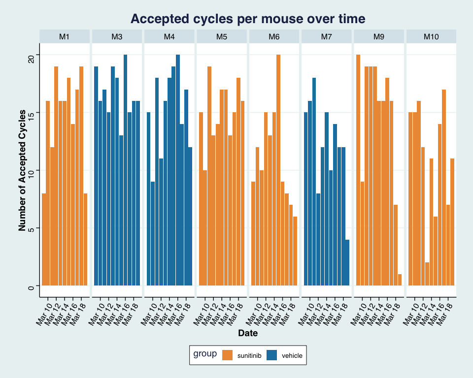<!-- -->
### Average animal body weight
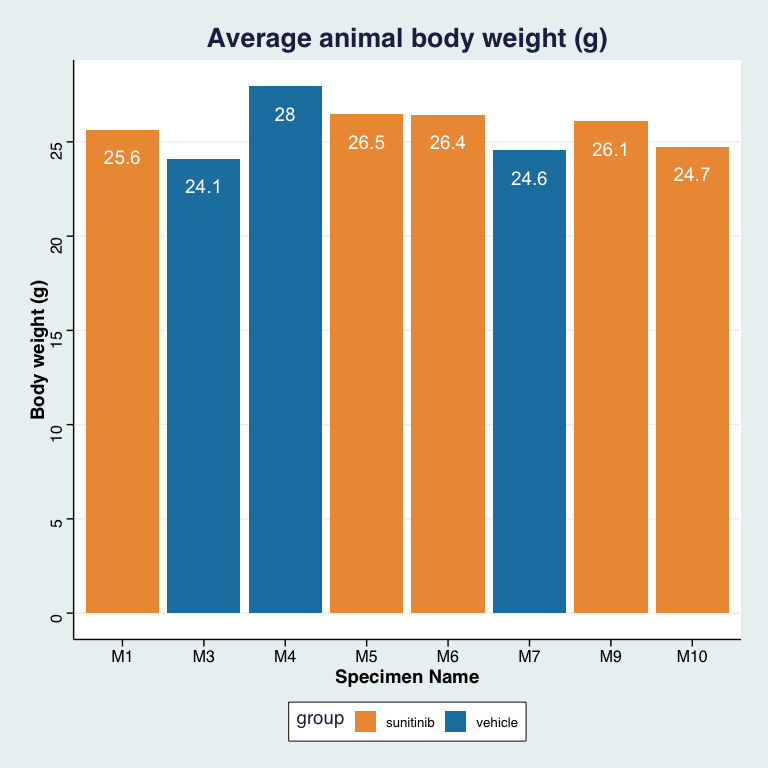<!-- -->

### Animal body weight change over time
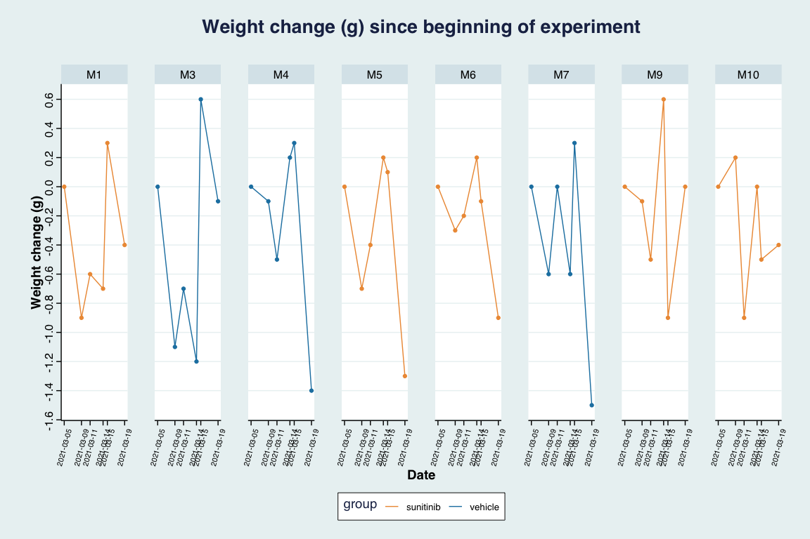<!-- -->

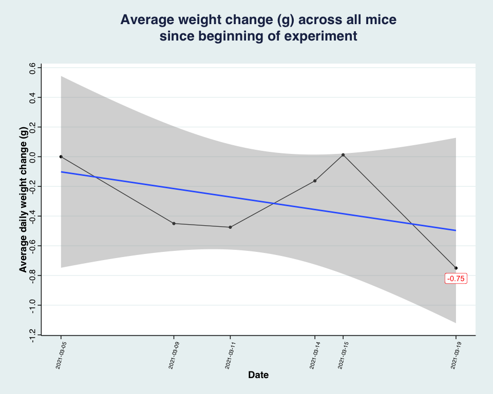<!-- -->

## Blood Pressure Data Analysis
### Filtering out days that had less than 'x' cycles
<table class="table table-striped" style="margin-left: auto; margin-right: auto;">
<caption>Removed days/Specimens with less than 5 cycles:</caption>
 <thead>
  <tr>
   <th style="text-align:left;"> Specimen Name </th>
   <th style="text-align:left;"> Date </th>
   <th style="text-align:left;"> group </th>
   <th style="text-align:right;"> # cycles </th>
   <th style="text-align:left;"> reason </th>
  </tr>
 </thead>
<tbody>
  <tr>
   <td style="text-align:left;"> M1 </td>
   <td style="text-align:left;"> 2021-03-12 </td>
   <td style="text-align:left;"> sunitinib </td>
   <td style="text-align:right;"> 19 </td>
   <td style="text-align:left;"> Bladder explosion </td>
  </tr>
  <tr>
   <td style="text-align:left;"> M10 </td>
   <td style="text-align:left;"> 2021-03-13 </td>
   <td style="text-align:left;"> sunitinib </td>
   <td style="text-align:right;"> 2 </td>
   <td style="text-align:left;"> Low cycle count </td>
  </tr>
  <tr>
   <td style="text-align:left;"> M7 </td>
   <td style="text-align:left;"> 2021-03-19 </td>
   <td style="text-align:left;"> vehicle </td>
   <td style="text-align:right;"> 4 </td>
   <td style="text-align:left;"> Low cycle count </td>
  </tr>
  <tr>
   <td style="text-align:left;"> M9 </td>
   <td style="text-align:left;"> 2021-03-19 </td>
   <td style="text-align:left;"> sunitinib </td>
   <td style="text-align:right;"> 1 </td>
   <td style="text-align:left;"> Low cycle count </td>
  </tr>
</tbody>
</table>

### Removing outliers
Detect outliers using boxplot methods. Boxplots are a popular and an easy method for identifying outliers. There are two categories of outlier: (1) outliers and (2) extreme points. Values above Q3 + 1.5xIQR or below Q1 - 1.5xIQR are considered as outliers. Values above Q3 + 3xIQR or below Q1 - 3xIQR are considered as extreme points (or extreme outliers). Q1 and Q3 are the first and third quartile, respectively. IQR is the interquartile range (IQR = Q3 - Q1).

Alternative method: If the absolute difference (i.e. abnormally high or low) between a measurement and the mean of all the cycles for that day is greater than twice the standard deviation for that day, that measurement is removed. It's assumed that this measurement is due to animal movement or some other non-biological cause.

## Plot the data over time and visualize the variance per day, per sample with boxplots, over all days
### Starting 03/05/21 - oral gavage and tailcuff training begins
### Starting 03/08/21 - baseline recording before vehicle treatment
### Starting 03/11/21 - vehicle treatment (10% PEG/ 0.5% Tween /~90% DI H2O at pH ~3.5) begins to establish baseline BP
### Starting 03/15/21 - Randomized to Sunitinib (40 mg/kg/d) treatment or vehicle begins

Since blood pressure is always measured before oral gavage, baseline goes from 03/08 to 03/11, but vehicle treatment starts on 03/11. Observed effect of treatment is then on 03/12!!

### Assess BP of randomized groups before beginning treatment
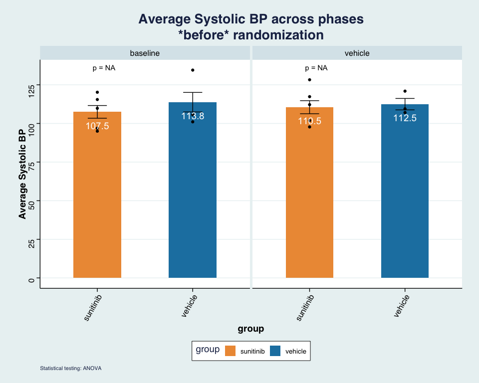<!-- -->

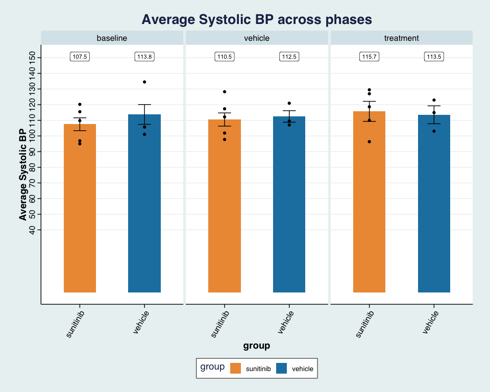<!-- -->

### Plotting average difference between groups across phases
Differences are calculated as change per specimen over each phase
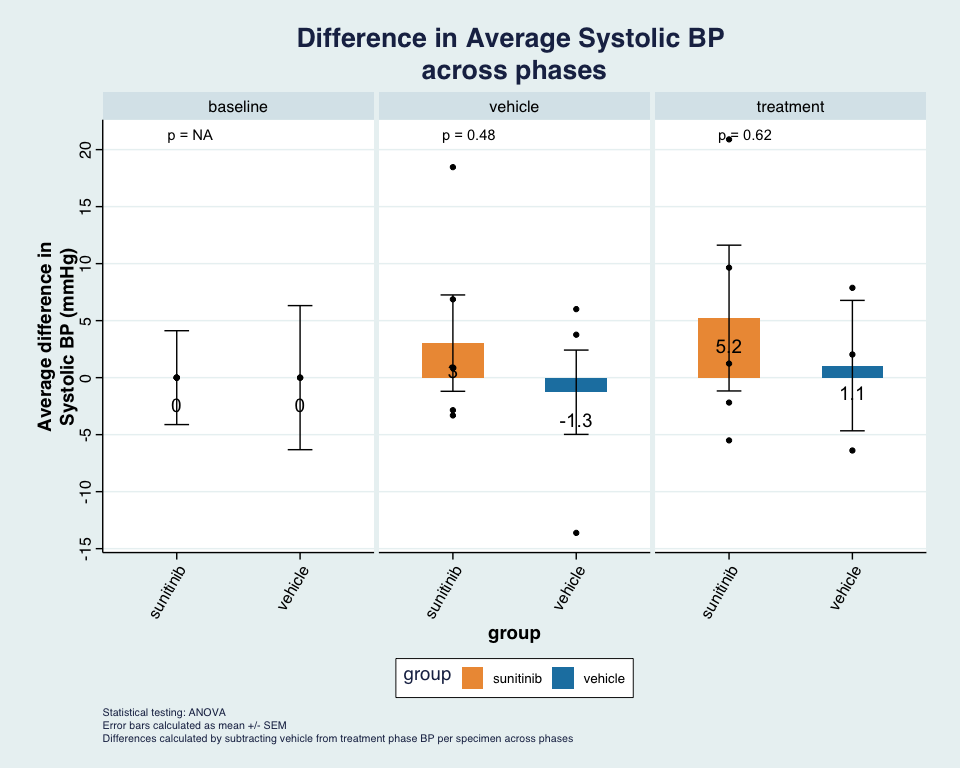<!-- -->

### Compared to average baseline
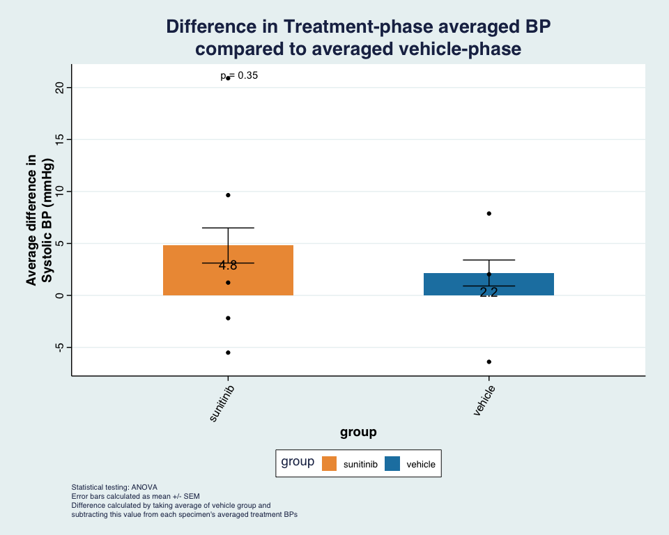<!-- -->

### Time-series data
For completeness, here is the time series data of each mouse across each Phase of the experiment:
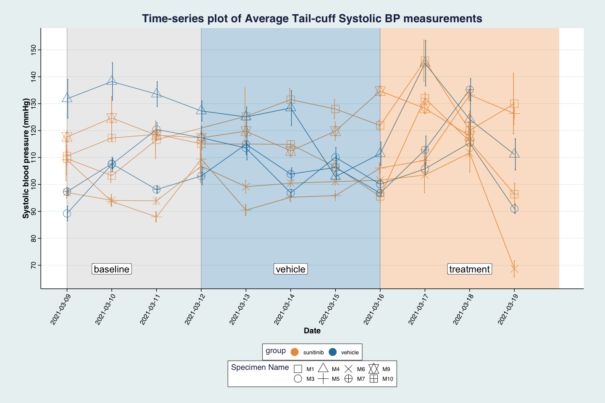<!-- -->

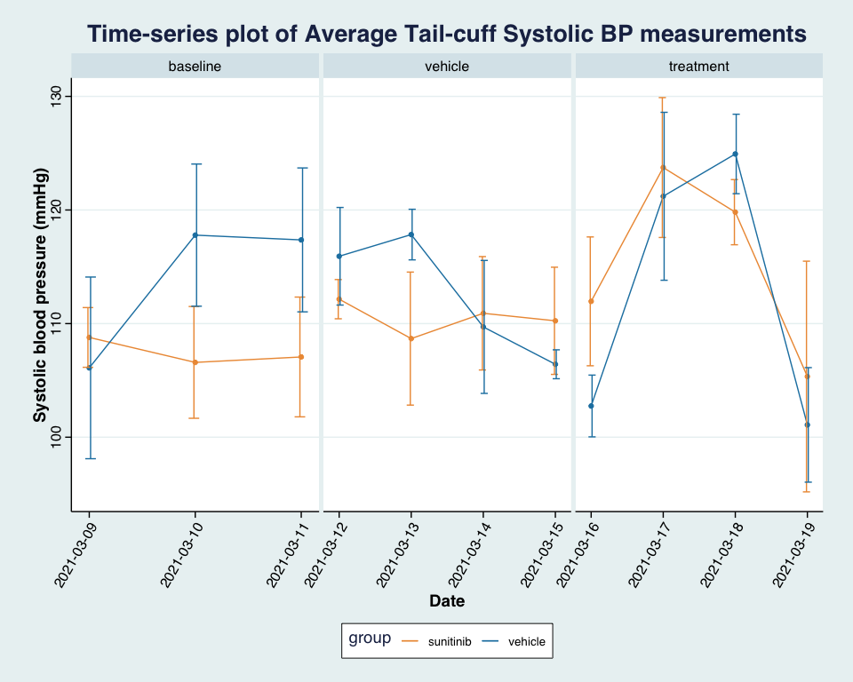<!-- -->

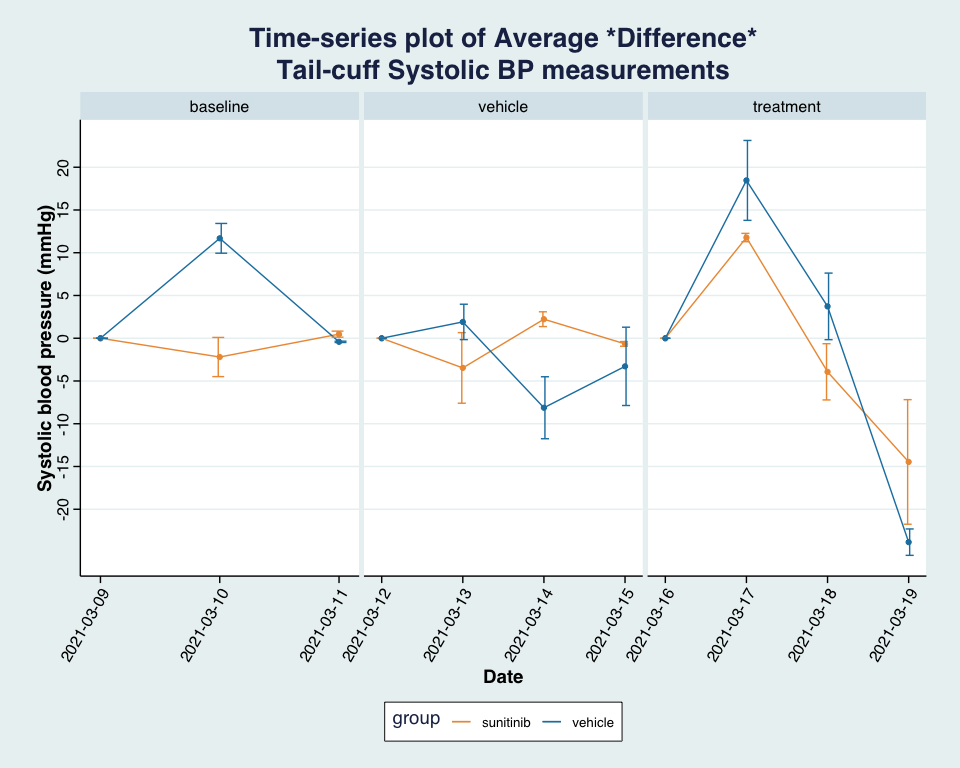<!-- -->

### Treatment with Sunitinib start on 03/15/21 BP (recording of effect starts on 03/16/21)
Since BP is recorded before gavage to reduce stress

These are the average blood pressures of each mice across each Phase of the experiment

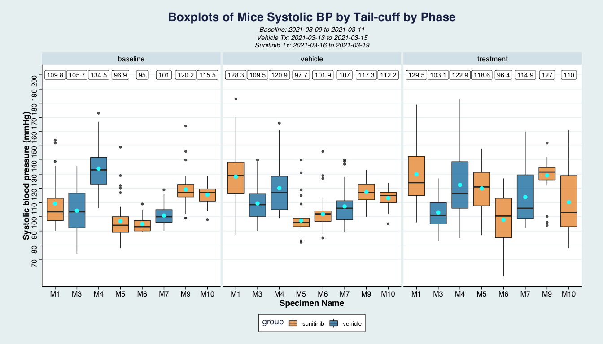<!-- -->

